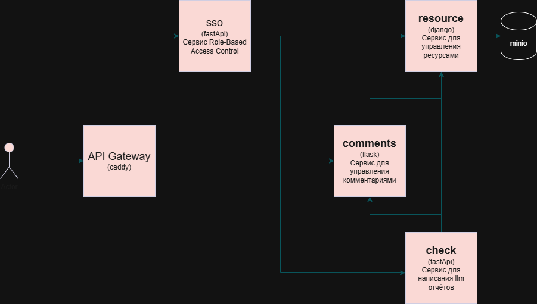

# Backend кинотеатра от команды moiami


### Архитектура




### Общее описание проекта

Backend часть онлайн-кинотеатра. Взаимодействие с внешним миром происходит через API-шлюз **Caddy**, который маршрутизирует HTTP-запросы к соответствующим микросервисам.

В проекте используются фреймворки: **FastAPI**, **Django** и **Flask**. Для хранения файлов используется **MinIO**, а для данных  **PostgreSQL**.

# Infrastructure

https://github.com/moiami/moiami_infrastructure

Репозиторий, содержащий docker compose файл для запуска проекта. В репозитории также находится dockerfile для caddy.

# Описание микросервисов

## SSO_SERVICE 

#### (Сервис авторизации)

https://github.com/moiami/moiami_sso

Отвечает за , аутентификацию пользователей, управление пользователями, управлением ролями пользователей. Сервис позволяет новых регистрировать пользователей, создавать роли. По умолчанию созданы роли для Admin и user. Также создан пользователь Admin. Отвечает за выдачу и валидацию jwt токенов.

**Фреймворк:**  **FastAPI**.

**Эндпоинты:**

1. POST /api/v1/auth/login
2. POST /api/v1/auth/validate
3. POST /api/v1/auth/refresh
4. POST /api/v1/auth/register
5. GET /api/v1/roles/roles
6. GET /api/v1/roles/role
7. POST /api/v1/roles/create_role
8. PATCH /api/v1/roles/update_role
9. DELETE /api/v1/roles/delete_role
10. GET /api/v1/user/users
11. GET /api/v1/user/user
12. POST /api/v1/user/change_role
13. DELETE /api/v1/user/delete_user

Чтобы увидеть более подробное описание воспользуйтесь swagger.

## RESOURCE_SERVICE 

#### (Сервис ресурсов)

https://github.com/moiami/moiami_resource_service

Отвечает за хранение фильмов, сортировку фильмов по жанрам, подписки на фильмы, плейлисты из фильмов. Пользователь, получив подписку, может посмотреть фильмы, входящие в подписку. Пользователь может составлять плейлисты из фильмов. Сервисом собирается статистика по количеству запросов на получение каждого фильма. Сервис предоставляет возможность получить список из самых часто запрашиваемых фильмов.

**Фреймворк:**  Django.

**Эндпоинты**

#### 1. GET /api/v1/catalog/genres/

**Описание:** Получение списка всех жанров.

**Ответ:**

```
[
  { "id": "uuid", "name": "string" }
]
```

#### 2. POST /api/v1/catalog/genres/

**Описание:** Создание нового жанра.

**Тело запроса:**

json

```
{
  "name": "Новый жанр"
}
```


**Ответ:**

json

```
{
  "id": "uuid",
  "name": "Новый жанр"
}
```

#### 3. GET /api/v1/catalog/genres/{id}/

**Описание:** Получение информации о конкретном жанре.

**Параметры пути:** id  (UUID)

**Ответ:**

json

```
{
  "id": "uuid",
  "name": "string"
}
```

#### 4. GET /api/v1/catalog/images/

**Описание:** Список всех изображений.

**Ответ:**

json

```
[
  { "id": "uuid", "link": "url" }
]
```

#### 5. POST /api/v1/catalog/images/

**Описание:** Загрузка нового изображения. Поддерживает multipart/form-data, application/x-www-form-urlencoded.

**Тело запроса (multipart/form-data):**

​	file — файл изображения.

**Ответ:**

json

```
{
  "id": "uuid",
  "file": "путь к файлу",
  "link": "url"
}
```

#### 6. GET /api/v1/catalog/images/{id}/

**Параметры пути:** id (UUID)

**Ответ:**

json

```
{
  "id": "uuid",
  "file": "string",
  "link": "url"
}
```

#### 7. PUT /api/v1/catalog/images/{id}/

**Описание:** Обновление изображения.

**Параметры пути:**  id (UUID)

**Тело запроса (multipart/form-data):**

​	file — файл изображения.

**Ответ:** обновлённый объект.

#### 8. DELETE /api/v1/catalog/images/{id}/

**Описание:** Удаление изображения.

**Ответ:** пустое тело

#### 9. GET /api/v1/catalog/videos/

**Описание:** Список всех видео.

**Ответ:**

json

```
[
  { "id": "uuid", "link360": "url", "link1080": "url" }
]
```

#### 10. POST /api/v1/catalog/videos/

**Описание:** Загрузка нового видеофайла. Поддерживает multipart/form-data.

**Тело запроса:**

​	quality (строка)

​	file (файл)

**Ответ:**

json

```
{
  "id": "uuid",
  "quality": "string",
  "file": "путь",
  "link360": "url",
  "link1080": "url"
}
```

#### 11. GET /api/v1/catalog/videos/{id}/

**Описание:** Детали видео.

**Ответ:** объект видео.

#### 12. DELETE /api/v1/catalog/videos/{id}/

**Описание:** Удаление видео.

#### 13. GET /api/v1/catalog/movies/

**Описание:** Список фильмов с фильтрацией.

Можно производить поиск по полям: точное совпадение по полям director, script_writer, age_restriction, date, date_of_premiere, country, genres (UUID).

**Ответ:**

json

```
[
  { "id": "uuid", "name": "string" }
]
```

#### 14. POST /api/v1/catalog/movies/

**Описание:** Создание нового фильма.

**Тело запроса (JSON):**

	1. name (string) 
	1. description (string)
	1. director (string)
	1. script_writer (string)
	1. age_restriction (string)
	1. date (date)
	1. date_of_premiere (date)
	1. country (string)
	1. subscriptions (список ID подписок)
	1. poster (UUID изображения)
	1. video (UUID видео)
	1. genres (список UUID жанров)

**Ответ:** полный объект фильма  с вложенными жанрами, постером и видео.

#### 15. GET /api/v1/catalog/movies/{id}/

**Описание:** Детальная информация о фильме. При наличии заголовка X-User-Id у запроса регистрируется действие просмотр.

**Ответ:** объект Movie.

#### 16. GET /api/v1/catalog/movies/{id}/genres/

**Описание:** Жанры фильма.

**Ответ:** массив жанров.

#### 17. GET /api/v1/catalog/movies/{id}/film_statistics/

**Описание:** Количество просмотров фильма за период.
**Параметры:** start_timestamp (int), end_timestamp (int)

**Ответ:**

json

```
{ "views_count": 150 }
```

#### 18. GET /api/v1/catalog/movies/top/

**Описание:** Топ фильмов по просмотрам за период.

**Параметры:** start_timestamp, end_timestamp, limit (1-1000)

**Ответ:**

json

```
[
  { "id": "uuid", "name": "string", "views_count": 500 }
]
```

#### 19. GET /api/v1/catalog/movies/subscriptions/{subscription_id}/

**Описание:** Фильмы, доступные по подписке.

**Ответ:** массив фильмов.

#### 20. GET /api/v1/subscriptions/

**Описание:** Список всех доступных подписок.

**Ответ:**

json

```
[
  { "id": 1, "name": "string" }
]
```

#### 21. POST /api/v1/subscriptions/

**Описание:** Создание новой подписки.

**Тело запроса (JSON):**

json

```
{
  "name": "Название",
  "description": "Описание",
  "price": "99.99"
}
```

**Ответ:** полный объект подписки.

#### 22. GET /api/v1/subscriptions/{id}/

**Описание:** Детали подписки.

**Ответ:**

json

```
{
  "id": 1,
  "name": "string",
  "description": "string",
  "price": "decimal"
}
```

#### 23. POST /api/v1/user-subscriptions/add/

**Описание:** Оформление подписки текущему пользователю.

Обязателен заголовок X-User-Id

**Тело запроса:**

json

```
{ "subscription_id": 1 }
```

#### 24. GET /api/v1/user-subscriptions/check/{subscription_id}/

**Описание:** Проверить наличие подписки у текущего пользователя.

Обязателен заголовок X-User-Id

**Ответ:**

json

```
{
  "user_id": "uuid",
  "subscription_id": 1,
  "has_subscription": true
}
```

#### 25. GET /api/v1/user-subscriptions/{subscription_id}/users/

**Описание:** Список пользователей, у которых есть данная подписка.

Обязателен заголовок X-User-Id

**Ответ:**

json

```
{
  "subscription_id": 1,
  "users_count": 2,
  "users": [
    { "user_id": "uuid", "subscription_expires_at": "datetime" }
  ]
}
```

#### 26. GET /api/v1/watchlists

**Описание:** Список watchlist'ов текущего пользователя.

Обязателен заголовок X-User-Id

**Ответ:**

json

```
{
  "count": 5,
  "next": null,
  "previous": null,
  "watchlists": [
    { "id": "uuid", "name": "string" }
  ]
}
```

Поддерживается пагинация.

#### 27. POST /api/v1/watchlists

**Описание:** Создание нового watchlist а.

Обязателен заголовок X-User-Id

**Тело запроса:**

json

```
{ "name": "Мой список" }
```

**Ответ:** полный объект WatchList.

#### 28. GET /api/v1/watchlists/{id}

**Описание:** Детали watchlist'а.

Обязателен заголовок X-User-Id

**Ответ:** WatchList.

#### 29. DELETE /api/v1/watchlists/{id}

**Описание:** Удаление watchlist'а.

#### 30. POST /api/v1/watchlists/{id}/movies

**Описание:** Добавление фильма в watchlist.

Обязателен заголовок X-User-Id

**Тело запроса:**

json

```
{ "movie_id": "uuid фильма" }
```

**Ответ:** обновлённый WatchList.

## COMMENT_SERVICE 

#### (Сервис комментариев)

https://github.com/moiami/moiami_comments_service

Отвечает за управление комментариями, оставленными на фильмы и лайки, поставленные на комментарии. Сервис собирает статистику по количеству лайков на одном комментарии. 

**Эндпоинты**

1. POST /api/v1/comments
2. GET /api/v1/comments/{comment_id}
3. PUT /api/v1/comments/{comment_id}
4. DELETE /api/v1/comments/{comments_id}
5. POST /api/v1/comments/{comment_id}
6. POST /api/v1/comments/{comment_id}/likes
7. GET /api/v1/comments/{comment_id}/likes
8. GET /api/v1/comments/{comment_id}/likes/count
9. DELETE /api/v1/comments/{comment_id}/likes

Чтобы увидеть более подробное описание воспользуйтесь swagger.

**Фреймворк:** **Flask**.

#### CHECK_SERVICE 

#### (Сервис проверки и обзоров от llm)

https://github.com/moiami/moiami_check_service

Отвечает за модерацию контента и генерацию аналитики с помощью ИИ, также ежедневно генерирует текстовые обзоры на 5 самых популярных фильмов за прошлый день. Логика создания ревью выбрана для большей случайности и субъективности обзора. Также сервис предоставляет возможность пользователям с правами admin отправить комментарий на проверку. Что не должен содержать комментарий: 1. Ненависть/дискриминация по признакам (раса, нация, религия, гендер и т.д.), 2. Призывы к насилию, угрозы, вред себе/другим, 3. Оскорбления, унижения, травля, 4. Сексуальный контент (особенно с участием несовершеннолетних) или чрезмерно непристойный, 5. Спам/реклама/фишинг. ИИ выносит вердикт, следует ли блокировать комментарий, но финальное решение за пользователем с правами admin. Также сервис предоставляет возможность пользователям с правами admin отправить пользователя кинотеатра на проверку. ИИ напишет отчёт о поведении пользователя, основываясь на прошлых отчётах, написанных о пользователе,  его комментариях. ИИ выносит вердикт, следует ли блокировать пользователя, но финальное решение за пользователем с правами admin.

Эндпоинты:

1. GET /health/
2. POST /api/v1/check/comment
3. POST /api/v1/check/user
4. GET /api/v1/news/
5. GET /api/v1/news/latest
6. GET /api/v1/news/{id}
7. PATCH /api/v1/news/
8. DELETE /api/v1/news/
9. GET /api/v1/reports/
10. GET /api/v1/reports/{id}
11. PATCH /api/v1/reports/
12. DELETE /api/v1/reports/
13. GET /api/v1/comment-reports/
14. GET /api/v1/comment-reports/{id}
15. PATCH /api/v1/comment-reports/
16. DELETE /api/v1/comment-reports/
17. GET /api/v1/film-reviews/
18. GET /api/v1/film-reviews/{id}
19. PATCH /api/v1/film-reviews/
20. DELETE /api/v1/film-reviews/

Чтобы увидеть более подробное описание воспользуйтесь swagger.

## Главные ручки

### POST /api/v1/check/comment
Проверка комментария по правилам модерации

Правила:
- Ненависть/дискриминация по признакам (раса, нация, религия, гендер и т.д.)
- Призывы к насилию, угрозы, вред себе/другим
- Оскорбления, унижения, травля
- Сексуальный контент (особенно с участием несовершеннолетних) или чрезмерно непристойный
- Спам/реклама/фишинг

### POST /api/v1/check/user
Проверка пользователя на основе истории его комментариев и прошлых отчетов.

Правила:
- Систематические нарушения правил (повторяемость токсичных комментариев или репортов)
- Спам-поведение (много однотипных сообщений или рекламы)
- Ненависть/дискриминация по признакам (раса, нация, религия, гендер и т.д.)
- Призывы к насилию, угрозы, вред себе/другим
- Целенаправленная травля других пользователей
- Распространение вредного или опасного контента (фишинг, вредоносные ссылки)
- Нарушения в разных контекстах (не разовый случай, а повторяемость)

### GET /api/v1/news/latest
Возвращает `news_id` последней новости, сгенерированной системой.

Бизнес-логика генерации новостей:
- Раз в день фоновая задача запрашивает топ фильмов за сутки из resource-service.
- Для каждого фильма LLM генерирует категорию дня и короткое ревью.

**Фреймворк:** **FastAPI**.

## Доска проекта на Miro:

https://miro.com/app/board/uXjVG-KlISw=/


# Команда

Леонид Гурьянов М8О-105БВ-25 (Тимлид): Вклад в проект: [вклад Леонид](vklad/gl.md)

Эдуард Батурин М8О-105БВ-25: Вклад в проект: [вклад Эдуард](vklad/be.md)

Арсений Изотов М8О-105БВ-25: Вклад в проект: [вклад Арсений](vklad/ia.md)

Семён Ягид М8О-106БВ-25: Вклад в проект: [вклад Семён](vklad/ys.md)
